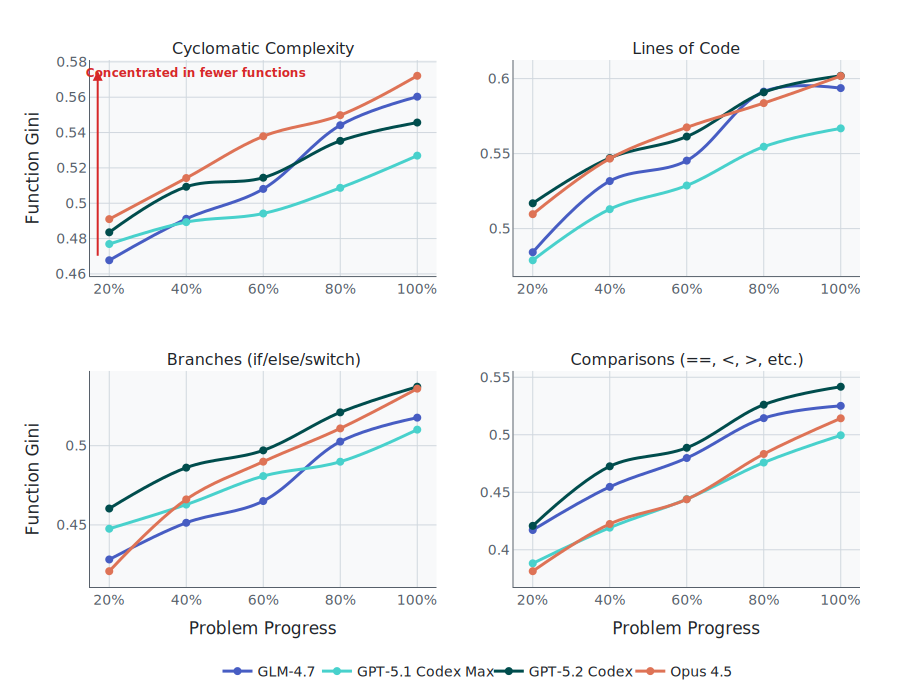
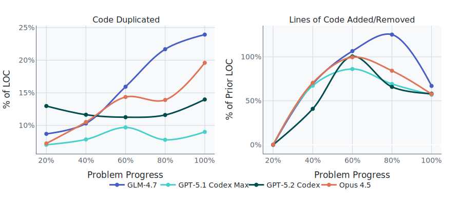

<div class="btn-group">
  <a href="https://www.scbench.ai" class="btn btn-primary">SCBench</a>
  <a href="https://x.com/Gorlanski" class="btn btn-twitter">@Gorlanski</a>
</div>

> **TL;DR:** Leading coding agents become lazy patchers when faced with iterative changes. They fall into copy-paste habits instead of refactoring, leading to massive god functions that become unmaintainable. This is why they *feel* worse than their scores on leading benchmarks and why we need realistic benchmarks like [SlopCodeBench](https://www.scbench.ai).

**Contents**

[TOC]

Instead of using the 2x holiday rate limits to vibe code some B2B SaaS, I decided to stress test the top coding agents with [SlopCodeBench (SCBench)](https://www.scbench.ai). In SCBench, each "problem" is a sequence of checkpoints. The agent must extend its existing solution to satisfy the specification for the current checkpoint. Iterative change, not one-shot coding, is where maintainability matters.

We use a very similar setup to our [announcement blog post](/posts/slop-code-bench/), but have now expanded to 93 checkpoints across 20 problems (see the [Methodology](#methodology) section for details).

This is the first part of our series discussing these results and the benchmark harness overhaul. We find that agents are exceptionally lazy in how they handle problem extensions. Rather than refactoring when appropriate, they fall into the common trap of copying and pasting code snippets. Thus, we are left with massive and unmaintainable "god" methods.


## Edits Concentrate into Hotspots



<details>
<summary>Function Gini, Branches, and Complexity</summary>

**Function Gini coefficient:**  
Measures how unevenly code is distributed among functions.  
- **0:** Code is spread out evenly across all functions.
- **1:** All code resides in a single function.
High values mean most code lives in a few "god" functions, making the codebase harder to maintain.

**Branch count:**  
The total number of decision points (e.g., `if`, `elif`, `else`, `case` statements) present in the code. More branches can indicate tangled logic or a lack of proper abstraction.

**Cyclomatic complexity:**  
A metric representing the number of independent paths through the code. Higher values suggest more complicated, harder-to-test functions and a greater potential for bugs or maintenance headaches.

**Comparisons:**  
Counts of explicit conditional checks (e.g., `==`, `!=`, `<`, `>`, in `if`/`while`/`for` conditions), which can reflect how tightly logic is entwined. More comparisons often mean increased complexity and a higher risk of logic errors.

Together, these metrics illustrate how code structure degrades: functions swell, branching logic proliferates, complexity rises, and maintainability plummets as agents focus only on passing the next test.

</details>

Across all setups, a clear pattern emerges: **agents make large patches in a select few functions.** The Gini coefficient climbs steadily as agents progress through checkpoints, highlighting the emergence of god functions that become nearly impossible to debug and maintain. These monstrosities also impose a significant cognitive burden during review. This would not be bad if these solutions were split into cohesive modules, but they are not. Each setup uses a single file spanning more than 2,000 lines across all problems.


| Model | STMT Gini (Start → Final) | LOC Gini (Start → Final) |
| :---- | :---- | :---- |
| GLM-4.7 | 0.531 → 0.584 | 0.518 → 0.594 |
| GPT-5.2-Codex | 0.524 → 0.572 | 0.537 → 0.602 |
| GPT-5.1-Codex-Max | 0.525 → 0.559 | 0.494 → 0.567 |
| Opus 4.5 | 0.513 → 0.585 | 0.532 → 0.602 |

<details>
<summary>Table legend</summary>

* **STMT** = statements per function; 
* **LOC** = lines of code per function. 
* Higher Gini = more concentration in fewer functions.
</details>

Both statements (number of top-level expressions as counted by tree-sitter) and LOC further support this finding. 

## Obvious Abstractions Turn Into Quick Hacks

The *worst* offender is [code search](https://www.scbench.ai/problems/code_search). At checkpoint 3, the agent must add tree-sitter pattern matching to an existing rule dispatcher. Across all agents, the LOC concentration *increases 16%* despite the clear motivation to refactor. Here is how I would have written the dispatcher:

```py
def find_matches(text, rules, language):
    for rule in rules:
        if language not in rule.languages:
            continue
        yield from rule(text, language)
```

This is not great, but at least I won't have to update it every time new rules are added. I could see the argument for using a dictionary or if statements as well—it's very unlikely there will be more than five kinds of rules. Either approach would keep it simple as long as the logic for finding matches is encapsulated.

### GPT-5.2-Codex's 140-line Monstrosity

```python del={1} ins={2,29-56}
def find_matches(text: str, rules: List[Dict], language: str) -> List[Dict]:
def find_matches(text: str, rules: List[Dict], language: str, encoding: str) -> List[Dict]:
    line_starts = build_line_starts(text)
    ...
    for rule in rules:
        if rule["kind"] == "exact":
            ...
            while True:
                ...
                matches.append({
                    "rule_id": rule_id,
                    "start": {"line": start_line, "col": start_col},
                    "end": {"line": end_line, "col": end_col},
                    "match": pattern,
                })
        elif rule["kind"] == "regex":
            regex = rule["regex"]
            if regex is None:
                continue
            for match in regex.finditer(text):
                ...
                matches.append({
                    "rule_id": rule_id,
                    "start": {"line": start_line, "col": start_col},
                    "end": {"line": end_line, "col": end_col},
                    "match": match.group(0),
                })

    pattern_rules = [r for r in rules if r["kind"] == "pattern"]
    if pattern_rules:
        ...
        for rule in pattern_rules:
            ...
            if root_info["is_sequence"]:
                ...
                for node in nodes:
                    ...
                    matches.append({
                        "rule_id": rule_id,
                        "start": {"line": start_line, "col": start_col},
                        "end": {"line": end_line, "col": end_col},
                        "match": match_text,
                        "captures": build_captures_output(...),
                    })
            else:
                ...
                for node in nodes:
                    ...
                    matches.append({
                        "rule_id": rule_id,
                        "start": {"line": start_line, "col": start_col},
                        "end": {"line": end_line, "col": end_col},
                        "match": match_text,
                        "captures": build_captures_output(...),
                    })
    ...
    return matches
```

There are so many baffling decisions here. Why filter the rules list *after* iterating over it, only to iterate again? Why copy the match construction *twice more* when the structure already exists? It _reeks_ of hacky coding. Worst of all, this function comes out to over 140 lines. 


### GPT-5.1-Codex-Max Shows Some Progress

At least GPT-5.1-Codex-Max does _slightly_ better. The original dispatch function was renamed from `scan_file` to `scan_text_rules`. Then `if rule.kind == "pattern": continue` was added to skip pattern rules:

```python del={1} ins={2,7-8}
def scan_file(content: str, rules: Sequence[Rule], language: str):
def scan_text_rules(content: str, rules: Sequence[Rule], language: str):
    # ... initialization ...
    for rule in rules:
        if language not in rule.languages:
            continue
        if rule.kind == "pattern":
            continue
        # ... matching logic ...
        for start, end in spans:
            yield {
                "rule_id": rule.rule_id,
                "language": language,
                "start": {"line": start_line, "col": start_col},
                "end": {"line": end_line, "col": end_col},
                "slice": (start, end),
            }
```

Why not extend the dispatcher? Why skip pattern rules here only to handle them elsewhere? It's infuriating and confusing, especially when looking at how these rules are handled in `main`:

```python ins={2,11-20} del={1}
for match in scan_file(content, applicable_rules, language):
for match in scan_text_rules(content, applicable_text_rules or [], language):
    matches.append({
        "rule_id": match["rule_id"],
        "file": file_rel,
        "language": match["language"],
        "start": match["start"],
        "end": match["end"],
        "match": content[match["slice"][0] : match["slice"][1]],
    })
if applicable_pattern_rules:
    content_bytes = content.encode("utf-8")
    line_start_bytes = build_line_start_bytes(content_bytes)
    tree = PARSERS[language].parse(content_bytes)
    for rule in applicable_pattern_rules:
        for match in collect_pattern_matches(
            tree, content_bytes, rule, language, line_start_bytes
        ):
            match["file"] = file_rel
            matches.append(match)
```

A new branch, loop, and source of match dictionaries. The construction used in `collect_pattern_matches` is nearly verbatim:

```python
yield {
    "rule_id": rule.rule_id,
    "file": "",  # filled by caller
    "language": language,
    "start": {"line": start_line, "col": start_col},
    "end": {"line": end_line, "col": end_col},
    "match": content_bytes[start_byte:end_byte].decode("utf-8", errors="replace"),
    "captures": captures_out,
}
```

Four places to update when the format changes. Four places for one update to slip through. Everyone has dealt with this in the days before agents. The time and annoyance of fixing these bugs is immense, even for agents.

### Slopus 4.5 is Slightly Better

Opus 4.5 extended the dispatcher correctly:

```python ins={8-15}
def find_matches(content, rule, language=None):
    if rule["kind"] == "exact":
        ...
        matches.append({"rule_id": rule["id"], "start": ..., "end": ..., "match": pattern})
    elif rule["kind"] == "regex":
        ...
        matches.append({"rule_id": rule["id"], "start": ..., "end": ..., "match": m.group(0)})
    elif rule["kind"] == "pattern":
        matcher = PatternMatcher(rule["pattern"], rule["languages"])
        for m in matcher.find_matches(content, language):
            matches.append({
                "rule_id": rule["id"],
                "start": m["start"], "end": m["end"],
                "match": m["match"], "captures": m["captures"]
            })
    return matches
```

One function with a proper `elif` extension. The 300-line `PatternMatcher` class encapsulates the tree-sitter logic. This is progress.

But look at the pattern branch. `PatternMatcher.find_matches` returns dicts with `start`, `end`, `match`, and `captures`. Then those dicts are immediately re-wrapped to add `rule_id`:

```python
# PatternMatcher returns
{'start': ..., 'end': ..., 'match': match_text, 'captures': captures}

# Caller copies four fields to add one
{"rule_id": rule["id"], "start": m["start"], "end": m["end"], ...}
```

Why not pass `rule_id` to the class? A 300-line class with a single public method, and it cannot return a complete result. Additionally, a new instance is created for every rule on every file—no caching, pattern re-parsed each time.

The structure is correct. The integration was not thought through.

## Duplication Rises with Progress


<details>
<summary>Figure metrics</summary>

* **Clone ratio** = percentage of duplicated code blocks in the solution. 
* **Churn** = percentage of lines changed between checkpoints relative to total codebase size.

</details>

They *all* exhibit copy-pasting behavior *while* making significant changes to the codebase. GLM-4.7 is the worst offender—nearly 25% of its output is duplicated code, and it peaks at over 110% churn. GPT-5.1-Codex-Max is the best, with a ~9% clone ratio, but it still peaks at 80% churn. **As agents progress through problems, their sole goal is to pass the next test, with no concern for downstream maintainability.**

One of our newest problems, [`circuit_eval`](https://www.scbench.ai/problems/circuit_eval), spans 8 checkpoints. For Opus 4.5, this meant an 8x increase in lines of code for its single file, going from 627 to 5,204. Despite the churn, there are clear signs of hacky copy-pasting.

The *entire* literal parsing function is duplicated. Same regex, same validation, same errors—one just allows `X` in binary. First, `parse_literal` (65 lines):

```python
def parse_literal(text: str, for_input: bool = False) -> tuple[int, int]:
    error_class = InputValueParseError if for_input else CircParseError
    text_clean = text.replace('_', '')

    if text_clean.upper() == 'X':
        raise error_class(f"Literal X value not allowed")

    sized_match = re.match(r"^(\d+)'([bhd])([0-9a-fA-F]+)$", text_clean)
    if sized_match:
        width = int(sized_match.group(1))
        base_char = sized_match.group(2).lower()
        digits = sized_match.group(3)
        if width == 0:
            raise error_class(f"Invalid literal width: 0")
        if base_char == 'b':
            if not all(c in '01' for c in digits):
                raise error_class(f"Invalid binary literal: {text}")
            value = int(digits, 2)
        elif base_char == 'h':
            value = int(digits, 16)
        else:  # 'd'
            value = int(digits, 10)
            if value >= (1 << width):
                raise error_class(f"Decimal value {value} exceeds width {width}")
        return value, width

    if text_clean.lower().startswith('0b'):
        digits = text_clean[2:]
        if not digits or not all(c in '01' for c in digits):
            raise error_class(f"Invalid binary literal: {text}")
        return int(digits, 2), len(digits)

    if text_clean.lower().startswith('0x'):
        digits = text_clean[2:]
        if not digits or not all(c in '0123456789abcdefABCDEF' for c in digits):
            raise error_class(f"Invalid hex literal: {text}")
        return int(digits, 16), len(digits) * 4

    if text_clean == '0': return 0, 1
    if text_clean == '1': return 1, 1
    raise error_class(f"Invalid literal: {text}")
```

Now look at `parse_3val_literal` (75 lines), introduced one checkpoint later:

```python
def parse_3val_literal(text: str) -> tuple[int, int, int]:
    text_clean = text.replace('_', '')

    if text_clean.upper() == 'X':
        return (0, 1, 1)

    sized_match = re.match(r"^(\d+)'([bhd])([0-9a-fA-F]+)$", text_clean)
    if sized_match:
        width = int(sized_match.group(1))
        base_char = sized_match.group(2).lower()
        digits = sized_match.group(3)
        if width == 0:
            raise InputValueParseError(f"Invalid literal width: 0")
        if base_char == 'h':
            value = int(digits, 16)
        else:  # 'd'
            value = int(digits, 10)
            if value >= (1 << width):
                raise InputValueParseError(f"Decimal value {value} exceeds width {width}")
        return (value, 0, width)

    if text_clean.lower().startswith('0b'):
        digits = text_clean[2:]
        if not digits:
            raise InputValueParseError(f"Invalid binary literal: {text}")
        # ... X parsing logic ...
        return (value, x_mask, len(digits))

    if text_clean.lower().startswith('0x'):
        digits = text_clean[2:]
        if not digits or not all(c in '0123456789abcdefABCDEF' for c in digits):
            raise InputValueParseError(f"Invalid hex literal: {text}")
        return (int(digits, 16), 0, len(digits) * 4)

    if text_clean == '0': return (0, 0, 1)
    if text_clean == '1': return (1, 0, 1)
    raise InputValueParseError(f"Invalid literal: {text}")
```

Same structure. Same regex. Same error messages. One function with `allow_x=True` would eliminate 60+ lines.

Tracing through the checkpoints reveals exactly when this happened. **Checkpoint 3** introduced `parse_literal`. Then **Checkpoint 4** needed 3-valued logic support. So the machine spirit copy-pasted the entire function to `parse_3val_literal` with a minor tweak to allow `X`. From **checkpoints 4 through 8**, neither function changed. The agent added 4,500+ lines of new code across those checkpoints without these functions ever being consolidated.

The agent also duplicated the *entire evaluator class*. `Evaluator` (150 lines) and `ThreeValuedEvaluator` (193 lines):

```python
class Evaluator:
    def __init__(self, circuit: Circuit):
        self.circuit = circuit
        self.values: dict[str, int] = {}
        self.assignment_map: dict[str, Assignment] = {}
        self.all_signals: dict[str, Signal] = {}
        for sig in circuit.inputs + circuit.outputs + circuit.wires:
            self.all_signals[sig.name] = sig
        for asgn in circuit.assignments:
            self.assignment_map[asgn.lhs] = asgn

    def evaluate(self, inputs: dict[str, int]) -> dict[str, int]:
        self.values = dict(inputs)
        outputs = {}
        for sig in sorted(self.circuit.outputs, key=lambda s: s.name):
            outputs[sig.name] = self._eval_signal(sig.name)
        return outputs

class ThreeValuedEvaluator:  # 150 lines later...
    def __init__(self, circuit: Circuit):
        self.circuit = circuit
        self.values: dict[str, tuple[int, int]] = {}  # only diff: tuple
        self.assignment_map: dict[str, Assignment] = {}
        self.all_signals: dict[str, Signal] = {}
        for sig in circuit.inputs + circuit.outputs + circuit.wires:
            self.all_signals[sig.name] = sig
        for asgn in circuit.assignments:
            self.assignment_map[asgn.lhs] = asgn

    def evaluate(self, inputs: dict[str, tuple[int, int]]) -> ...:
        self.values = dict(inputs)
        outputs = {}
        for sig in sorted(self.circuit.outputs, key=lambda s: s.name):
            outputs[sig.name] = self._eval_signal(sig.name)
        return outputs
```

The `__init__` and `evaluate` methods are *verbatim* copies. The only difference is `int` vs `tuple[int, int]`. A generic `Evaluator[T]` or even just passing a value-wrapper would unify 300+ lines into one class.

This is the lazy patcher pattern in action: **solve the immediate problem, move on, never look back.**

## Conclusion
One may be tempted to ask, *Why does it matter if the code is correct?* The SOTA checkpoint pass rate on SCBench is only 10.8%, so maybe these agents just aren't good enough yet. But that misses the larger point: we *should* expect them to do better. It is precisely from this expectation that the gap between benchmark scores and real-world use emerges. [As Dax from OpenCode put it](https://x.com/thdxr/status/2009382864446435353), solutions from LLMs are always the 2nd or 3rd best way of doing something.

This *can only* be evaluated through an iterative specification benchmark like SlopCodeBench. That is exactly why we created it. If you care about the real quality of coding agents, join the [Discord](https://discord.gg/BrC4BA9sVj) or [look at our repo](https://github.com/SprocketLab/slop-code-bench)! We are always looking for new contributors.


## Methodology

We now have 20 problems in total, with 93 checkpoints. GLM-4.7 and GPT-5.2-Codex results are now included—GLM-4.7 was run using Claude Code 2.0.75, and GPT-5.2-Codex was run using Codex 0.74.0. Following our original setup, we use only the "high" reasoning-effort setting for both harnesses and the just-solve prompt, which focuses purely on solving the problem.

Otherwise, it is nearly identical to [our announcement post](/posts/slop-code-bench#results).
