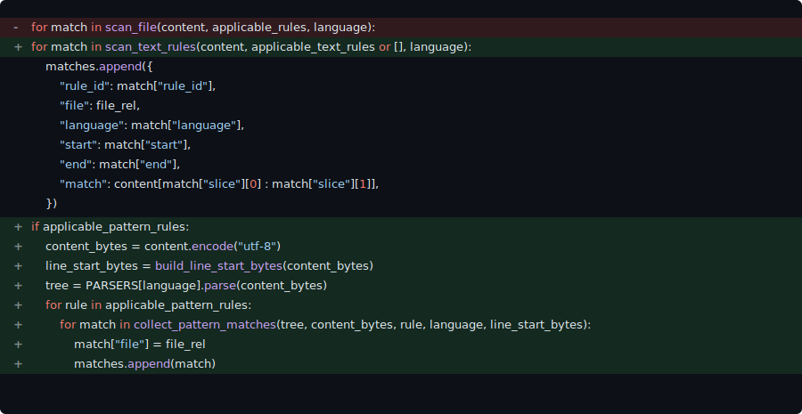
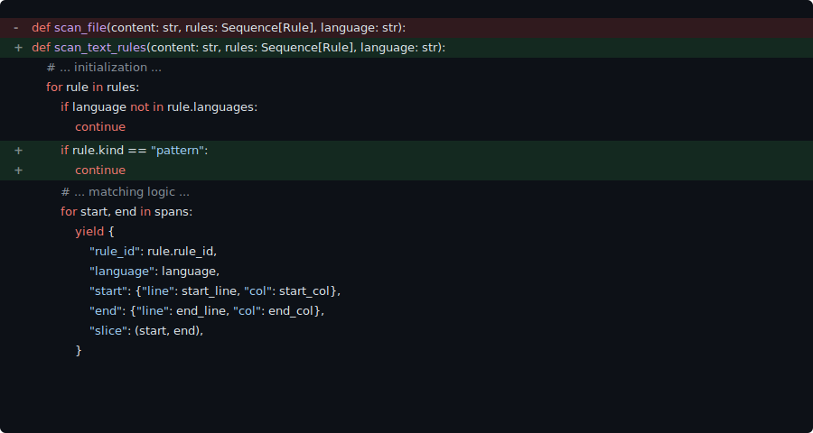
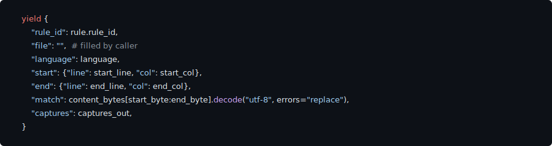

  <a href="https://www.scbench.ai" class="btn btn-primary">SCBench</a>
  <a href="https://x.com/Gorlanski" class="btn btn-twitter">@Gorlanski</a>

> **TL;DR:** Leading coding agents become lazy patchers when faced with iterative changes. They fall into copy-paste habits instead of refactoring, leading to massive god functions that become unmaintainable. This is why they *feel* worse than their scores on leading benchmarks and why we need realistic benchmarks like [SlopCodeBench](https://www.scbench.ai).

Instead of using the 2x holiday rate limits to vibe code some B2B SaaS, I decided to stress test the top coding agents. In [SlopCodeBench (SCBench)](https://www.scbench.ai): each “problem” is a sequence of checkpoints. The agent starts with its own previous solution and must extend it to satisfy the next checkpoint’s tests. Iterative change, not one-shot coding, is where maintainability matters.
We use a very similar setup to our [announcement blog post](/posts/slop-code-bench/), but have now expanded to 93 checkpoints across 20 problems (see the [Methodology](#methodology) section for details).

This is the first part in our series discussing these results and how we overhauled the benchmark framework. We find that they are exceptionally lazy in how they handle problem extensions. Rather than refactoring when appropriate, they fall into the common trap of copying and pasting code snippets. Thus, we are left with massive and unmaintainable "god" methods.

## Edits Concentrate into Hotspots

Function Gini, Branches, and Complexity

**Function Gini coefficient:**  
Measures how unevenly code is distributed among functions.  
- **0:** Code is spread out evenly across all functions.
- **1:** All code resides in a single function.
High values mean most code lives in a few “god” functions, making the codebase harder to maintain.

**Branch count:**  
The total number of decision points (e.g., `if`, `elif`, `else`, `case` statements) present in the code. More branches can indicate tangled logic or a lack of proper abstraction.

**Cyclomatic complexity:**  
A metric representing the number of independent paths through the code. Higher values suggest more complicated, harder-to-test functions and a greater potential for bugs or maintenance headaches.

**Comparisons:**  
Counts of explicit conditional checks (e.g., `==`, `!=`, `<`, `>`, in `if`/`while`/`for` conditions), which can reflect how tightly logic is entwined. More comparisons often mean increased complexity and a higher risk of logic errors.

Together, these metrics illustrate how code structure degrades: functions swell, branching logic proliferates, complexity rises, and maintainability plummets as agents focus only on passing the next test.

Across all setups, a clear pattern emerges: **agents make large patches in a select few functions.** The Gini coefficient climbs steadily as agents progress through checkpoints, highlighting the emergence of god functions that become near impossible to debug and maintain. These monstrosities also impose a significant cognitive load when reviewing. This would not be bad if these solutions were split into cohesive modules, but they are not. Each setup uses a single file spanning more than 2,000 lines across all problems.

| Model | STMT Gini (Start → Final) | LOC Gini (Start → Final) |
| :---- | :---- | :---- |
| Opus 4.5 | 0.513 → 0.585 | 0.532 → 0.602 |
| GLM 4.7 | 0.531 → 0.584 | 0.518 → 0.594 |
| GPT 5.2 Codex | 0.524 → 0.572 | 0.537 → 0.602 |
| GPT 5.1 Codex Max | 0.525 → 0.559 | 0.494 → 0.567 |

Table legend

* **STMT** = statements per function; 
* **LOC** = lines of code per function. 
* Higher Gini = more concentration in fewer functions.

Both statements (number of top-level expressions per treesitter) and LOC further support this finding. 

## Obvious Abstractions Turn Into Quick Hacks
Interestingly, the *worst* problem is [code search](https://www.scbench.ai/problems/code_search), where the agent must perform some refactoring to add a treesitter-like selection at checkpoint 3. Focusing on the transition from checkpoint 2 to checkpoint 3, LOC concentration *increases by 16%* despite the need to refactor. 
 
 

Here is an example from GPT 5.1 Codex Max of the changes made to update its solution. The most obvious sign of “lazy patching” is that the extra `applicable_pattern_rules` branch should not exist, and the `scan_file` function should have been extended. A slight nit of mine would have been to not reconstruct the dictionary nearly 1:1, but that is fine if it is just a single instance. In this case it clearly is not just one instance as the newly added function returns a match match dictionary. Errors could _easily_ occur if only one is updated -- everyone has had this happen multiple times that it _is_ an issue. Looking at the new `scan_text_file` function, we can see that it has been changed only slightly.   

   

Instead, the function was renamed, and a continue hack was added. This function was the *perfect* place to add in the dispatch to the new matching rules, but the easier solution was to hack these branches in the main and now in this function. Worst of all, the agent copied this dictionary yield code nearly verbatim:  

   

At this point, there would be nearly no reason to add this extra yield and keep the old construction. The better approach would be to have the single dispatcher receive the result from the `Rule` class and yield that, with only a single setting of the `file` key. Rather, the agent chose to duplicate code and cause more headaches for maintainers. And this pattern is true to all of the agents we tested.  

## Duplication rises with Progress

Figure metrics

* **Clone ratio** = percentage of duplicated code blocks in the solution. 
* **Churn** = percentage of lines changed between checkpoints relative to total codebase size.

They *all* exhibit both copy-pasting behavior *while* making significant changes to the codebase. GLM 4.7 is the worst offender — nearly 25% of its output is duplicated code, and it peaks at over 110% churn. GPT 5.1 Codex Max is the best, with a \~9% clone ratio, but it peaks at 80% churn. **As agents progress through problems, their sole goal is to pass the next test without any concern for downstream maintainability.**

## Conclusion
One may be tempted to ask *why it matters if the code is correct?* SoTA checkpoint pass rate on SCBench is only 10.8%. But there is a larger point: we *should* expect these agents to do better than this. It is precisely from this expectation that the gap between benchmark scores and real-world use emerges. [As Dax from OpenCode put it, solutions from LLMs are always the 2nd or 3rd best way of doing something.](https://x.com/thdxr/status/2009382864446435353)

This *can only* be evaluated through an iterative specification benchmark like SlopCodeBench. That is exactly why we created it. If you care about the real quality of coding agents, join the [discord](https://discord.gg/BrC4BA9sVj) or [look at our repo](https://github.com/SprocketLab/slop-code-bench)! We are always looking for new contributors.

## Methodology

We now have 20 problems in total, with 93 checkpoints. GLM 4.7 and GPT-5.2-Codex results are now included with Claude Code 2.0.75 and Codex 0.74.0, respectively. Following our original setup, we use only the "high" reasoning-effort setting for both harnesses and the just-solve prompt, which focuses on purely solving the problem.

Otherwise it is nearly identical to [our announcement post](/posts/slop-code-bench#results).
