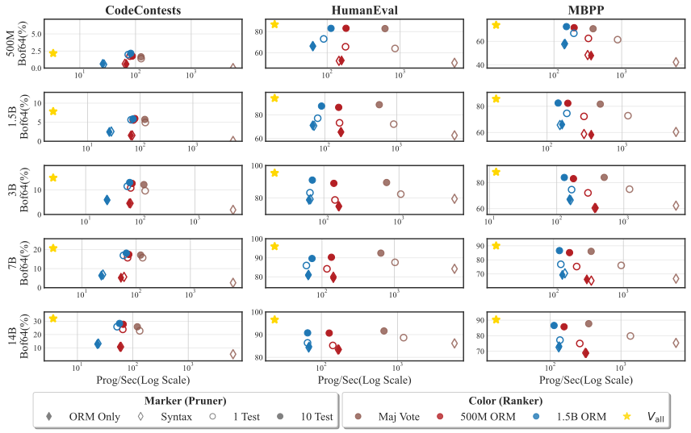

**TL;DR:** Outcome Reward Models for code verification allow one to trade accuracy for speed in the generate-then-rank paradigm. This tradeoff can be significantly improved through a generate-_prune_\-then-rank approach. A weaker verifier eliminates candidates before ranking with an outcome reward model, thus saving work on incorrect tokens. We show that this hybrid approach can be 11.65 times faster than running the whole test suite while only being 8.33% less accurate.

## Table of contents

## **The Growing Verification Bottleneck in AI Coding**

AI coding systems have a scaling problem that will get much worse. The standard approach is simple: _generate_ many candidate programs, _rank_ them by running the whole test suite, and pick the one that passes the most tests. This strategy is strong for solving math problems with string equivalence (i.e., [GSM8K](https://huggingface.co/datasets/openai/gsm8k), [MATH](https://huggingface.co/datasets/hendrycks/competition_math)) or generating solutions to [HumanEval](https://arxiv.org/abs/2107.03374), as verification costs are trivial.

However, current frontier models are already as proficient as junior developers and thus can tackle more complex problems. They have gone from code completion to creating pull requests for large projects. The increase in task complexity requires more complex testing to verify correctness. In particular, [SWE-Bench](https://arxiv.org/abs/2310.06770) requires spinning up Docker containers and running entire test suites. The cost of verification has additionally scaled with this increased complexity: what once took seconds per problem now takes minutes.

This verification bottleneck slows down inference and cripples training speed, since reinforcement learning from code requires verifiable signals. As AI tackles increasingly complex programming tasks, verification cost becomes the primary scaling limitation. **Thus, as the tasks become more complicated and [repeated sampling](https://arxiv.org/abs/2407.21787) continues to show promise, the increased verification cost will be the limiting factor in building scalable solutions.**

## **The Verification Trade-off**


The solution is recognizing that verification exists on a spectrum, not as a binary choice. Consider these verification methods ordered by speed and accuracy:

| Verifier              | Speed    | Accuracy | Use Case                    |
| --------------------- | -------- | -------- | --------------------------- |
| **Compilation check** | Fastest  | Very low | Quick syntax validation     |
| **Lint errors**       | Fast     | Low      | Code style and basic errors |
| **Single test**       | Moderate | Good     | Key functionality check     |
| **Full test suite**   | Slowest  | Perfect  | Comprehensive validation    |

**The key insight:** different scenarios demand different points on this trade-off curve. Reinforcement learning requires perfect accuracy, making complete test suites essential. However, a faster, slightly less accurate method might be optimal for code ranking during inference. Prior works (i.e., [MBR-Exec](https://arxiv.org/abs/2204.11454), [AlphaCode](https://alphacode.deepmind.com/), [CodeMonkeys](https://arxiv.org/abs/2501.14723)) have shown that the “weaker” verification methods can be valuable to improving overall ranking performance.

## **Outcome Reward Models Enable Scalable Code Verification**

Given this trade-off, an obvious approach would be to train a model to rank programs. Unlike test suites, a model only needs to be run a single time per program, and its speed is bounded by the model’s size and the length of the program. In practice, they can be any of many setups, but we focus primarily on the outcome reward model (**ORM**). Specifically, the case of fine-tuning a Large Language Model (**LLM**) to estimate the correctness of a program for a given natural language problem.

Recent works in reinforcement learning from verifiable rewards have demonstrated that these reward models are suboptimal compared to the reliable verifier. In the case of code ranking, there will almost always be a set of test suites one can use or create (e.g., fuzzing) as the reliable verifier. Specifically, [Deepseek-r1](https://arxiv.org/abs/2501.12948) and [Tulu 3](https://arxiv.org/abs/2411.15124) show that reward models are noisy and unreliable.

The issues with reward models in general have only been demonstrated in training settings. While their problems likely translate to test time, their place in the verification trade-off curve is unknown. Thus, we aim to answer the question: **Can outcome reward models significantly improve verification speed without sacrificing massive accuracy?**

We examine their performance across different programming tasks with increasingly larger verification costs by training different-sized ORMs on synthetic programs and evaluating their ability to rank candidates from a much larger LLM. We examine these in both the traditional _generate-then-rank_ and _generate-prune-then-rank_ settings. Our Findings are:

- **ORMs have a clear purpose for scalable program verification:** We show that ORMs can be used to trade accuracy for throughput by achieving average speedups of 9.5x compared to the strongest verifier while still being 33.55% better than filtering with a linter and taking the most common response across all of our tasks.
- **Pruning with a weak verifier before ranking improves accuracy and throughput:** The generate-prune-then-rank strategy can reduce accuracy loss and further improve throughput when using an ORM. A simple one-test filter improves accuracy by 2.85% with an additional 16.39% speedup over the ORM-only strategy. Increasing the number of tests to 10 improves accuracy by 10.38% while only losing 16.69% of throughput, yet this is still 29.71% faster than the whole test suite.
- **Weak verifiers mitigate ORM mistakes and reduce variance:** We empirically show that the performance gains from pruning are due to removing both high- and low-ranked candidates, emphasizing the importance of weak verifiers in mitigating ORM inaccuracies.

## **How do we measure the quality of a ranking system?**

We measure the accuracy of ranking methods using the best Best-of-k estimator proposed by [Hosseini, et al. [2024]](https://arxiv.org/abs/2402.06457). In short, Best-of-k estimates the probability that, given a randomly selected set of $k$ solutions, the top-ranked candidate will be correct. While other metrics to assess the quality of a ranking system (e.g., [nDCG](https://scikit-learn.org/stable/modules/generated/sklearn.metrics.ndcg_score.html)), Best-of-k is more reflective of the scenario where only a single candidate can be presented to the user. Some clear examples of this would be an agent that can only make a single PR, or a single completion can be presented to the user as the final answer.

As mentioned, a clear _cost is_ associated with ranking a set of candidates. Most related works examine this cost through the real dollar cost of using an API or the flops required to rank a solution. Yet, this does not reflect the actual _latency_ of these systems. And as mentioned above, that is an apparent bottleneck for the coming code ranking systems. Therefore, we measure the speed of ranking systems with programs per second (PPS). This allows us to incorporate the parallelization benefits while measuring the time for each program.

## Generate-Prune-then-Rank

We propose a hybrid strategy that combines the best of both worlds:  
**Traditional Pipeline**

```
Generate → Rank with complete tests → Select the best
```

**Our Hybrid Pipeline**

```
Generate → Prune with weak verifier → Rank survivors with ORM → Select best.
```

This approach leverages a crucial insight: **a program with syntax errors will never pass the full test suite, so why waste compute ranking it?** We can achieve significant speedups by filtering obvious failures with minimal verification before applying expensive ranking.

Overall results for the different pruning methods with a weak verifier and ranking methods. If “Filter” is “---”' that means no pruning is done. Green backgrounds are higher performance while Red backgrounds is lower performance concerning the entire column. “All Tests” is the case where _all_ test cases are run. “Syntax” and “Lint” remove programs with the respective errors. “N Test” prunes out programs that do not pass the first $N$ test cases. The evaluation dataset is generated with Qwen 2.5 Coder 7B Instruct using $T=1.0$, $n=128$, $top_p=0.95$, and 1024 tokens.


Here, we display the trade-off curves from our experiments using generator models of different sizes. Each row represents a different generator model. The colors represent different ranking strategies, while the markers represent different pruning methods. “Majority Voting” is the verifier-only setup where we use majority voting to select the best candidate after pruning with the weak verifier.



## **Why This Works**

Removing programs should increase throughput as we remove tokens, thus lowering the number of forward passes we need to make. However, to _improve_ the accuracy would mean that we have pruned out programs that the ORM rated highly. Take, for instance, the rankings:

```
Original: PPFPFFFPPFFFF
            ↑ ↑ ↑  ↑ ↑
 (P = Pass, F = Fail)
```

After pruning with a weak verifier

```
Filtered: PPPFFPP | FFFFFF
                    ↑↑↑↑↑↑
Pruned candidates.
```

The pruning removes two highly ranked but incorrect solutions, improving overall accuracy by correcting ORM errors. These two solutions represent the ORM's frequent mistakes, and thus, the pruning with weak verifiers could be seen as “mitigating” an ORM's shortcomings.

Here we plot the distribution of failed candidates based on the ORM's rank without prior filtering. A rank of 1 means the candidate was the top-ranked, while 128 means it was the lowest-ranked. The rows are the individual verifiers, while the columns are the datasets.  


---

_Technical details and experimental results are available in our full paper. Code will be released with publication._
