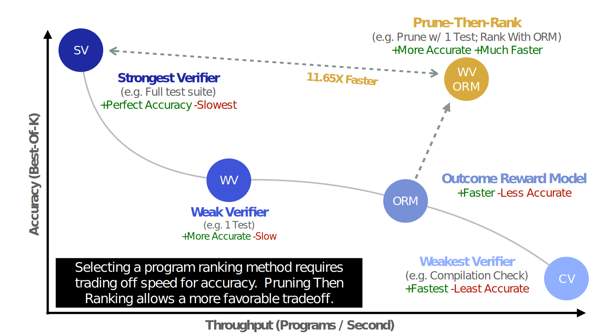

**TL;DR:** Outcome Reward Models for code verification allow one to trade accuracy for speed in the generate-then-rank paradigm. This can be further improved through a generate-prune-then-rank approach where a weaker verifier prunes solutions prior to ranking, thus saving work on incorrect tokens. We show that this hybrid approach can be 11.65 times faster than running the whole test suite while only being 8.33% less accurate. 

AI coding systems have a scaling problem that will get much worse. The standard approach is simple: *generate* many candidate programs, *rank* them by running the full test suite, and pick the one that passes the most tests. This is a strong strategy for solving math problems with string equivalence (i.e., [GSM8K](https://huggingface.co/datasets/openai/gsm8k), [MATH](https://huggingface.co/datasets/hendrycks/competition_math)) or generating solutions to [HumanEval](https://arxiv.org/abs/2107.03374), as verification costs are trivial. 

However, current frontier models can be junior developers, and thus, they can now tackle harder problems. [SWE-Bench](https://arxiv.org/abs/2310.06770) requires spinning up Docker containers and running entire test suites. The cost of verification has additionally scaled with this increased complexity: what once took seconds per problem now takes minutes. Due to the use of verifiable signals, this impacts training speed as well. **Thus, as the tasks become more complex and [repeated sampling](https://arxiv.org/abs/2407.21787) continues to show promise, the increased verification cost will be the limiting factor in building scalable solutions.**

## **The Verification Trade-off**

While the cost of **comprehensive verification** continues to climb, one can choose a “weaker” verifier that may not be as precise but is much faster. This creates a clear trade-off between accuracy and speed, which one can use to determine the appropriate method to use. Take, for example, the verifiers:

* **Compilation check:** Fastest, but very inaccurate  
* **Lint Errors:** Faster, but inaccurate  
* **Single test:** Slower, but accurate  
* **Full test suite:** Slowest, but perfect accuracy

The full test suite is the optimal choice for reinforcement learning, as correctness is more important than pure speed. However, a simple lint check is likely accurate enough for a code completion setting while being significantly faster. Prior works (i.e., [MBR-Exec](https://arxiv.org/abs/2204.11454), [AlphaCode](https://alphacode.deepmind.com/), [CodeMonkeys](https://arxiv.org/abs/2501.14723)) have shown that the “weaker” verification methods can be valuable to improving overall ranking performance.

An obvious approach, given this trade-off would be to train a model to rank programs. Unlike test suites, a model only needs to be ran a single time per program and its speed is bounded by the model’s size and the length of the program. In practice they can be any one of a large number of setups, but we focus on primarily the outcome reward model (**ORM**). Specifically, the case of fine-tuning a Large Language Model (**LLM**) to estimate the correctness of a program for a given natural language problem.

Recent works in reinforcement learning from verifiable rewards have clearly demonstrated that these reward models are suboptimal compared to the reliable verifier. In the case of code ranking, there will almost always be a set of test suites one can use or create (e.g fuzzing) as the reliable verifier. Specifically [Deepseek-r1](https://arxiv.org/abs/2501.12948) and [Tulu 3](https://arxiv.org/abs/2411.15124) show that reward models are noisy and unreliable.

## **Outcome Reward Models Enable Scalable Code Verification**

The demonstrated issues with reward models in general have only been demonstrated in training settings. While it is likely their issues translate to test-time, there place in the verification trade-off curve is unknown. Thus we aim to answer the question: **Can outcome reward models significantly improve verification speed without sacrificing massive accuracy?**

Through training 

## **Generate, *Prune*, then Rank** 

Instead of abandoning ORMs, use them strategically. Combine cheap verification with ORM ranking:

1. Generate many candidates  
2. Prune obvious failures with minimal verification  
3. Rank survivors with an ORM

   
**INSERT EXAMPLE PICTURE**

## **The Results Are Clear**

We tested this on CodeContests, a challenging programming benchmark:  
Full test suite: 20.69% accuracy, 2.95 programs/second  
 ORM alone: 5.21% accuracy, 52.45 programs/second  
 Our approach: 18.97% accuracy, 34.31 programs/second  
The hybrid method runs 11.65x faster than full verification while losing just 1.72 percentage points of accuracy. You can evaluate 11x more candidates in the same time.  
This isn't just faster. It's actually scalable.

## **Why This Works**

ORMs fail predictably. They get fooled by plausible-looking code with subtle bugs. Our analysis shows the pruning step catches exactly these cases.  
Removed solutions had average ranks of 55 and 43 out of 128\. The ORM thought they were good candidates. A single test revealed they were broken.  
Remove the confusing cases and ORM rankings become much more reliable. Different verification methods have complementary strengths. Fast verifiers catch obvious errors. ORMs handle nuanced quality judgments.

## **The Path Forward**

Recent advances in repeated sampling are powerful but unsustainable with current verification approaches. As systems generate more candidates to solve harder problems, verification becomes the bottleneck.  
ORMs offer a way out. Despite their flaws, they enable truly scalable verification through generate-prune-then-rank. This approach:

* Reduces verification cost by 10x or more  
* Maintains most of the accuracy benefits  
* Scales naturally with candidate count  
* Works with existing infrastructure

The future of AI coding isn't just about generating better solutions. It's about verifying them efficiently at scale. Systems that solve the verification bottleneck will have a decisive advantage.  
Generate-then-rank got us this far. Generate-prune-then-rank will take us much further.  
---

*Technical details and experimental results are available in our full paper. Code will be released with publication.*
