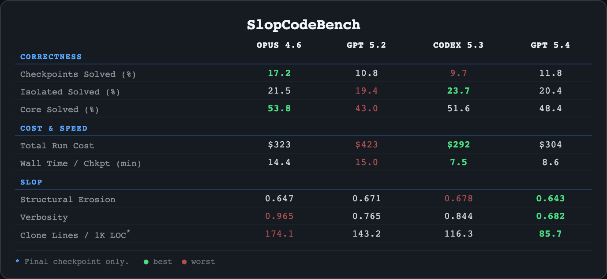
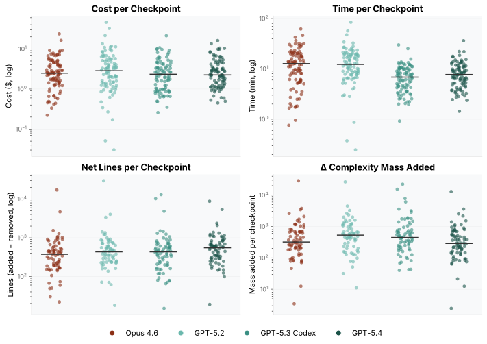
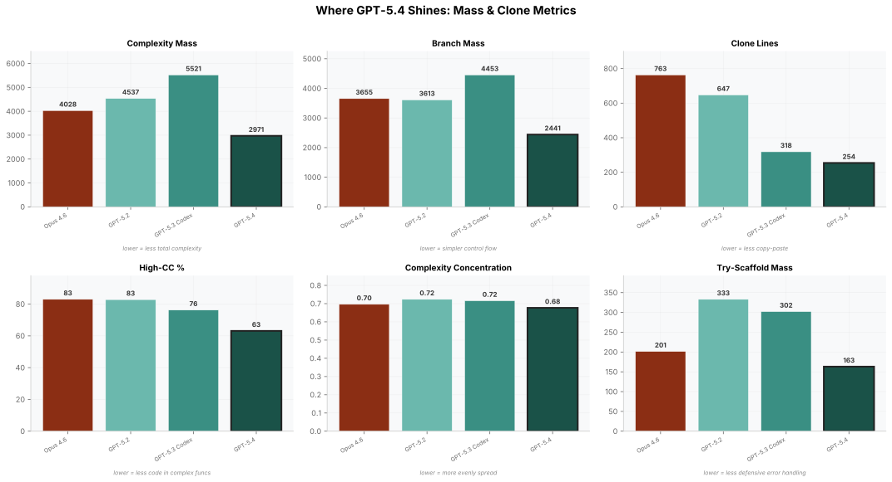
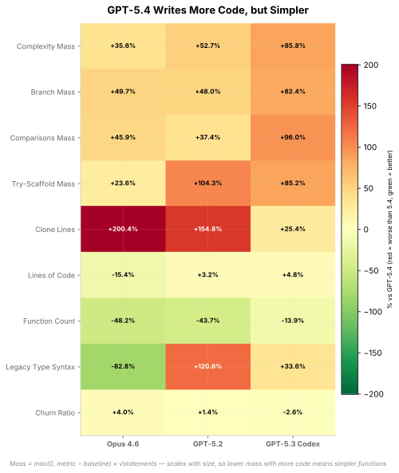

<div class="btn-group">
  <a href="https://www.scbench.ai" class="btn btn-primary">SCBench</a>
  <a href="https://x.com/Gorlanski" class="btn btn-twitter">@Gorlanski</a>
</div>



> **TL;DR:** GPT 5.4 is a marked improvement over 5.2 but should not be your daily driver over Codex 5.3 or Opus 4.6. Yet, there are signs of clear qualitative improvements as bloat, erosion, and duplication are down. But GPT 5.4 has traded this cleaner code for worse performance at a higher cost.
[TOC]

In our [last post](/posts/opus-4-6-gpt-5-3-scbench/), Opus 4.6 and GPT-5.3 Codex were better than their predecessors but still produced god functions, duplication, and structural rot. OpenAI just shipped GPT-5.4. Every quality metric improves. It also fails more tests.

| Model | Pass % | Core % | LOC | +/- Lines | CC Mean | Erosion | High-CC % | Clones/1K |
|-------|--------|--------|-----|-----------|---------|---------|-----------|-----------|
| GPT-5.1 Codex | 59% | 45% | 1645 | +2311 / -338 | 7.1 | 0.69 | 73.7% | 90 |
| GPT-5.2 | 63% | 51% | 3208 | +4318 / -171 | 8.1 | 0.72 | 82.8% | 143 |
| GPT-5.2 Codex | 64% | 58% | 2314 | +2808 / -198 | 8.2 | 0.76 | 83.1% | 133 |
| GPT-5.3 Codex | 66% | 69% | 3257 | +4040 / -253 | 7.8 | 0.72 | 76.3% | 116 |
| **GPT-5.4** | **63%** | **64%** | 3110 | **+4103 / -454** | **5.1** | **0.68** | **63.1%** | **86** |

<details>
<summary>Column definitions</summary>

* **Erosion** -- complexity mass concentration (0-1). Replaces the composite erosion metric from our [previous post](/posts/opus-4-6-gpt-5-3-scbench/). Higher means more god functions.
* **High-CC %** -- percentage of total complexity mass in functions with CC > 10.
* **Clones/1K** -- duplicate lines per 1,000 LOC.

</details>

5.4 is a clear upgrade to 5.2 but still lags behind both Opus 4.6 and 5.3 Codex on correctness. It wins every quality column — CC mean drops 34%, erosion drops, Clones/1K drops 26% — but pass rate drops 3 points and core drops 5.

The question is whether that tradeoff is a training artifact or something fundamental.

## Signs of Improvement



| Per Checkpoint | GPT-5.3 | GPT-5.4 | Delta |
|----------------|---------|---------|-------|
| Steps | 81 | 45 | -44% |
| Duration (min) | 46 | 32 | -30% |
| Cost ($) | $3.14 | $3.27 | +4% |
| Input tokens | 1.46M | 1.07M | -27% |
| Output tokens | 25.3K | 23.5K | -7% |

5.4 takes less time per checkpoint than GPT-5.2 while writing more lines of code. It reads 27% fewer input tokens and finishes 30% faster. The cost is essentially flat because the model is more expensive per token, but it uses fewer of them. This is consistent with the structural story — it has a clearer plan and executes it in fewer iterations.

On the first checkpoint, performance is within 1pp of 5.3 Codex (78.5% vs 79.7% pass, 82.5% vs 84.6% core). But its early decisions compound — errors in the first checkpoint cascade through later ones. Hence the regression in multi-checkpoint evolution. The lag behind 5.3 Codex is almost certainly due to training regimes. When OpenAI releases Codex 5.4, it should eclipse its predecessors.

The improvements are not just in efficiency. The quality signals point to real gains. We return to our favorite example problem, `code_search`. There is now tangible progress in code organization.

Take the humble rule loading function. Codex 5.3 packs 108 lines into a single `load_rules()`:

```python
def load_rules(rules_path: Path) -> List[Dict[str, object]]:
    # ... file loading ...
    for idx, rule in enumerate(parsed):
        rule_id = rule.get("id")
        if not isinstance(rule_id, str) or rule_id == "":
            raise RulesValidationError(f"Rule at index {idx} has invalid id")
        # ... 40 more lines of inline field checks ...
        fix_config = rule.get("fix")
        if fix_config is not None:
            if not isinstance(fix_config, dict):
                raise RulesValidationError(f"Rule {rule_id} has invalid fix")
            fix_kind = fix_config.get("kind")
            if fix_kind != "replace":
                raise RulesValidationError(f"Rule {rule_id} has invalid fix kind")
            validated_fix = {"kind": "replace", "template": template}
        # ... regex compilation, pattern compilation ...
        validated_rules.append({"id": rule_id, "kind": kind, ...})
    return validated_rules
```

Antiquated type annotations. Four levels of nesting. Dict construction repeated everywhere. GPT-5.4 decomposes it:

```python
def load_rules(rules_path: Path) -> list[Rule]:
    # ... file loading ...
    for index, item in enumerate(payload):
        rules.append(validate_rule(item, index, seen_ids))
    return rules

def validate_rule(item: object, index: int, seen_ids: set[str]) -> Rule:
    # ... field validation ...
    fix = validate_fix(item.get("fix"), prefix)
    return Rule(rule_id=rule_id, kind=kind, pattern=pattern,
                compiled_regex=compiled_regex, fix=fix, ...)

def validate_fix(value: object, prefix: str) -> FixSpec | None:
    if value is None:
        return None
    # ... 10 lines of fix-specific validation ...
```

It is certainly more maintainable and 100% cleaner to read. The decomposition also enabled a new check — 5.4 validates fix template placeholders against the rule's metavariables. Neither 5.2 nor 5.3 does this.

The same pattern shows up on `execution_server`. GPT-5.3's `_handle_execute` is 164 lines — validation, caching, execution, stats, response building, all inline with raw globals and manual locks. GPT-5.4 compresses the same behavior into 49 lines with named helpers (`ExecutionCache`, `EnvironmentExecution`, `STATS`, `validate_execute_request`). This is what erosion dropping from 0.70 to 0.51 looks like on a single problem.

## GPT-5.4's Odd Behaviors



GPT-5.4 likes to write more code, but it does not fall into the god function trap of other models. The reduction in clone lines is really quite impactful. But there is a weirdness to how it spreads out its code.

| Metric | GPT-5.3 | GPT-5.4 | Delta |
|--------|---------|---------|-------|
| Statements per function | 9.5 | 5.7 | -40% |
| Lines per symbol | 27.4 | 19.7 | -28% |
| Try-scaffold mass | 302 | 163 | -46% |
| Max nesting depth | 5.5 | 4.9 | -11% |
| Symbols total | 172 | 221 | +29% |
| Classes | 15.8 | 24.1 | +53% |
| Methods | 34.5 | 55.9 | +62% |
| Trivial wrappers | 3.0 | 7.0 | +133% |

Top half: genuinely better. Smaller functions, shallower nesting, half the try/except scaffolding. Bottom half: the cost. 29% more symbols in *less* code, classes up 53%, trivial wrappers more than double. The pattern is consistent with explicit training against slop — 5.4 learned "small functions good" and over-applied it, producing wrappers that just call another function and classes where a module-level function would do.

### Type Annotation Inconsistency



Unfortunately, the base model comes through, and there is a terrible inconsistency with type annotations. We checked every final snapshot across all 20 problems:

| Model | Pure Modern | Pure Legacy | Mixed | No Types |
|-------|------------|-------------|-------|----------|
| GPT-5.2 | 5 | 5 | **10** | 0 |
| GPT-5.2 Codex | 3 | 8 | 4 | 5 |
| GPT-5.3 Codex | 3 | **14** | 2 | 1 |
| GPT-5.4 | **11** | 2 | **7** | 0 |

GPT-5.2 was the most confused — 10/20 problems mix `List[str]` and `list[str]` in the same file. GPT-5.3 "fixed" this by going almost entirely legacy: 14/20 pure `typing.List`/`Dict`/`Optional`. Consistent, just consistently old.

GPT-5.4 swings the other way — 11/20 pure modern (`list[str]`, `| None`). Clear preference for the right style. But 7 problems still mix both in the same file. `dynamic_config_service_api` has 417 legacy annotations and 6 modern ones. `database_migration` is 21% modern — it shifted mid-stream but never went back. Once 5.4 picks a style for checkpoint 1, the legacy annotations persist through all later checkpoints even as new code uses modern syntax. It will never attempt to update old legacy annotations.

5.3 is more consistent simply because it consistently picks the wrong style. 5.4 picked up the right habit but applies it inconsistently.

### Capabilities Dropped Across Generations

Returning to `code_search`, we see the downside to OpenAI's iterations. 5.2 had multi-pattern support (sliding-window matching for patterns that parse to multiple AST nodes) and separator-skipping for optional metavars. 5.4 replaced inline wrapping logic with a clean `PATTERN_PARSE_STRATEGIES` dispatch table — but dropped both features. They happen to be untested, so pass rates are identical. The code is less capable.

Each generation cleans up the *structure* while quietly dropping *capabilities* that happened to be untested.

## The GPT Model Arc

**5.1** — scrappiest. Shortest solutions, lowest scores.

**5.2** — most defensive. Try/except everywhere, highest erosion (0.76). Over-engineered but thorough. Most confused on type style (10/20 mixed).

**5.3** — stripped everything down. Dicts instead of dataclasses. Best scores (66% pass, 69% core). Most fragile. Consistently legacy types (14/20).

**5.4** — cleanest architecture. But lost edge cases. Passes fewer tests. Best type defaults (11/20 modern) but doesn't self-correct.

**5.3's messy code solves more problems than 5.4's clean code.** Structure isn't the bottleneck. Boundary inference is.

## Conclusion

5.4 writes code you'd want to maintain, but you also need to be more vigilant in checking for incorrect code. SlopCodeBench demonstrates that code correctness and quality are not on the same axis. The models are getting better at writing code that looks right. They're not getting better at making code that is right.

We want to keep pushing these models and investigating what the future of code agents will be. The [GitHub repo](https://github.com/SprocketLab/slop-code-bench) is open. Join us on [Discord](https://discord.gg/BrC4BA9sVj).

## Methodology

All results: 20 SCBench problems, 93 checkpoints. Same "just-solve" prompt, thinking=high, Codex CLI. Pinned versions (5.1: 0.65.0, 5.2: 0.93.0, 5.3: 0.98.0, 5.4: 0.110.0). See our [announcement post](/posts/slop-code-bench/) for scoring details.
