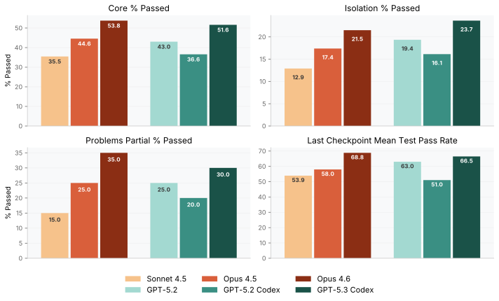
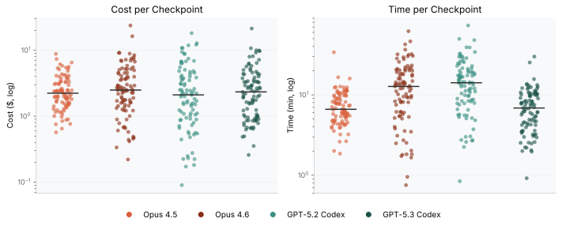
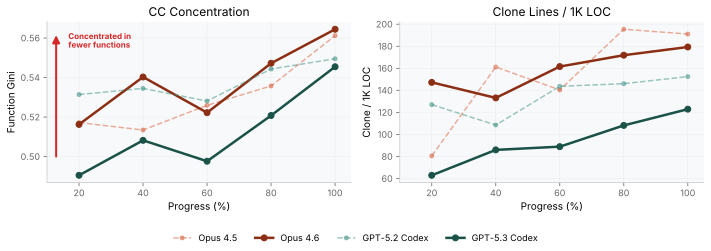
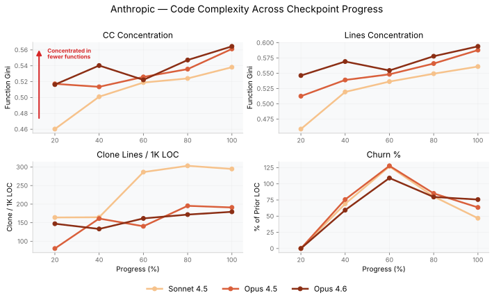
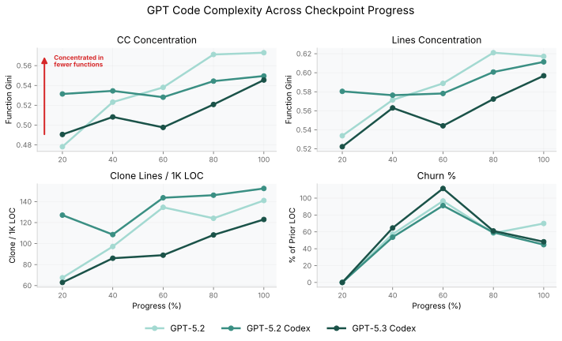

<div class="btn-group">
  <a href="https://www.scbench.ai" class="btn btn-primary">SCBench</a>
  <a href="https://x.com/Gorlanski" class="btn btn-twitter">@Gorlanski</a>
</div>


> **TL;DR:** Opus 4.6 hits 53.8% core on SCBench but only 21.5% in isolation. GPT-5.3 Codex shows the same pattern at 51.6% core, 23.7% iso. Most 'passing' solutions are coupled to prior checkpoint state. They fail in opposite directions. Opus copy-pastes and sprawls. Codex over-abstracts and deepens. Both still produce god functions and structural rot. Two case studies ([`circuit_eval`](https://www.scbench.ai/problems/circuit_eval) and [`execution_server`](https://www.scbench.ai/problems/execution_server)) show where it goes wrong, plus a guide for when to trust, when to intervene, and when to restart.

[TOC]


In our [last post](/posts/agent-copy-pasta/), we showed that coding agents are lazy patchers -- copy-paste duplication, god functions, missed abstractions. Because both Anthropic and OpenAI dropped new models last week, we now have results for Opus 4.6 and GPT-5.3 Codex for [SlopCodeBench](https://www.scbench.ai).

| Model | Core % | Iso % | Cost/CKPT | Verbosity | Erosion |
|-------|--------|-------|---------|-----------|---------|
| Sonnet 4.5 | 35.5% | 12.9% | $1.54 | 0.909 | 0.485 |
| Opus 4.5 | 44.6% | 17.4% | $2.64 | 0.932 | 0.490 |
| **Opus 4.6** | **53.8%** | **21.5%** | $3.47 | 0.965 | **0.442** |
| GPT-5.2 | 43.0% | 19.4% | $4.55 | 0.765 | 0.462 |
| GPT-5.2 Codex | 36.6% | 14.0% | $3.21 | 0.723 | 0.398 |
| **GPT-5.3 Codex** | **51.6%** | **23.7%** | $3.14 | 0.844 | **0.432** |

<details>
<summary>Column definitions</summary>

* **Core %** -- percentage of checkpoints where just the _core_ tests pass against the agent's cumulative solution.
* **Iso %** -- percentage where the solution passes all _checkpoint_ tests independently, regardless of whether it failed the prior checkpoints.
* **Cost/CKPT** -- average USD cost per checkpoint.
* **Verbosity** -- Ratio of AST-Grep-flagged spans plus rubric flags to logical lines of code.
* **Erosion** -- Percentage of functions with >10 Cyclomatic Complexity + lint errors per line of code. Functions with CC>30 counted twice.

</details>


Higher scores, yes, but most checkpoints still fail when run in isolation. The misses are boundary inference, not algorithms, and *when* they happen matters more than how many.

## The new models Head to Head



GPT-5.3 Codex is 54% faster per checkpoint than GPT-5.2 Codex (16.2 → 7.5 min mean). Opus 4.6 is nearly twice as slow as 4.5 (7.6 → 14.4 min mean). For cost, Opus 4.6 is 32% more expensive than 4.5 ($2.64 → $3.47), while GPT-5.3 Codex is 2% cheaper than 5.2 Codex ($3.21 → $3.14).




Complexity concentration differs by 0.013 at the final checkpoints. But for copy-paste hackiness, Opus 4.6 is much worse: 174 clone lines per 1K versus 116 for GPT-5.3 Codex.


### The Differences Emerge At the Boundaries

The differences are at the _boundaries_: serialization, reporting, validation, postconditions. **Once a boundary assumption lands at CKPT3 or CKPT4, every later checkpoint builds on top of it.**

We covered [`code_search`](https://www.scbench.ai/problems/code_search) last time. This post traces two problems checkpoint by checkpoint: [`circuit_eval`](https://www.scbench.ai/problems/circuit_eval) and [`execution_server`](https://www.scbench.ai/problems/execution_server).

### Perfect through CKPT3, then boundary misses persist

Our first study is on our longest problem, [circuit_eval](https://www.scbench.ai/problems/circuit_eval), where the agent is tasked with implementing a CLI tool for parsing and analyzing small digital circuits. It starts as a strict parser/validator, then grows into an evaluator (2val and 3val), and ends with a deterministic optimizer + equivalence checks. This problem is mostly boundary work: literal formats, width rules, canonical output, and postconditions.

<details>
<summary>Checkpoint progression</summary>

| CKPT | Adds (high level) |
|---:|---|
| 1 | CLI + `check` for scalar `.circ` parsing/validation |
| 2 | Scalar 2-valued `eval` |
| 3 | Vectors, slicing/concat, richer literals, and `--radix` |
| 4 | `--mode 3val` evaluation (X in runtime inputs; binary-only radix) |
| 5 | `--format`: add `.json` and `.bench` inputs |
| 6 | Analysis tools: `stats`, `lint`, and `dot` |
| 7 | `cone`, `truth-table`, and `equiv` (plus `--seed`) |
| 8 | Optimizer `opt` (passes, determinism, `--verify`, `--fanin-limit`) |

</details>

Progression: both models are perfect through CKPT3 (203/203). The first split is CKPT4 (Opus 428/428 vs Codex 427/428). By the end, totals are nearly tied (CKPT8: Codex 554/557 vs Opus 553/557), but core diverges the other way on `opt` postconditions (Codex 15/17 vs Opus 17/17).

The split starts at CKPT4 (3val mode). The first failure itself is small (an input-parsing edge case), but the more revealing artifact is how both implementations grow across checkpoints. Each new part adds a subcommand or a handful of flags, and both agents respond by attaching another branch to their CLI dispatcher.

Opus 4.6 (checkpoint 8): `opt` flag parsing lives inside `main()` and mixes parsing, defaults, and JSON error routing in one block.
```python
elif command == 'opt':
    filepath = args[1]
    rest = args[2:]
    output_path = None
    pipeline = 'default'
    max_iters = 6

    i = 0
    while i < len(rest):
        a = rest[i]
        if a == '-o':
            if i + 1 >= len(rest):
                err = CliUsageError("-o requires a value")
                if use_json:
                    output_json(make_error_response("opt", err))
                else:
                    print(f"Error: {err}", file=sys.stderr)
                sys.exit(EXIT_CLI_USAGE)
            output_path = rest[i + 1]
            i += 2
```

GPT-5.3 Codex (checkpoint 8): parsing is centralized in `parse_action()`, which returns a structured Action that `main()` then executes.
```python
if command == "opt":
    out_path: Optional[str] = None
    pipeline = "default"
    max_iters = 6

    idx = 0
    while idx < len(rest):
        token = rest[idx]
        if token in {"-o", "--output"}:
            if idx + 1 >= len(rest):
                raise CliUsageError("-o requires a path")
            out_path = rest[idx + 1]
            idx += 2
            continue
```

Same "lazy patcher" dynamic from our first post. The dispatcher is the easiest place to land changes, so it keeps growing until it _is_ the API boundary.

### A single mistake in CKPT3 creates a 7-test gap through CKPT5

We now examine [execution_server](https://www.scbench.ai/problems/execution_server): a minimal HTTP API for CI-style local execution. You send a JSON request describing a command (later: command chains), environment variables, file overlays, stdin, and timeouts; the server runs the process unsandboxed, then returns stdout/stderr, plus optional tracked output files and stats. Later checkpoints add structured file serialization, caching, and persistent environments with concurrency rules.

<details>
<summary>Checkpoint progression</summary>

| CKPT | Adds (high level) |
|---:|---|
| 1 | `POST /v1/execute` + `GET /v1/stats/execution` (timeouts, stdin, env, file overlay) |
| 2 | `track`: glob output files and return contents |
| 3 | Structured `files` values + serialize by extension (json/yaml/csv/jsonl + compression) |
| 4 | Command chains + `continue_on_error` + per-command stats |
| 5 | In-memory cache (`force` bypass) + cache stats |
| 6 | Persistent environments: `POST /v1/environment`, concurrency modes, required `environment` in execute |

</details>

Progression: CKPT1-2 are tied (43/45, then 56/58 for both). CKPT3 is where the gap opens (Codex 100/103 vs Opus 93/103; core 16/16 vs 14/16), and it persists through CKPT5 (184/187 vs 177/187). CKPT6 narrows to a 1-test gap (69/70 vs 68/70), but core still differs (25/25 vs 24/25).

This problem is almost entirely request/response normalization. Each checkpoint adds more shape to the request (`track`, structured `files`, command chains, caching, environments), so the question is where to put the normalization layer. In this head-to-head, the CKPT3 gap is one strict-type gate in that layer (`files` scalars): Codex serializes them for `.json` paths, while Opus rejects them.

Opus 4.6 (checkpoint 6): validation and normalization happens inline in `handle_execute()`, branching early on "single command vs chain".
```python
command = body.get("command")
if command is None:
    return _error_response(400, "Field 'command' is required", "MISSING_FIELD")

is_chain = isinstance(command, list)

if is_chain:
    if len(command) == 0:
        return _error_response(
            400, "Field 'command' array must not be empty", "INVALID_FIELD"
        )
    for i, cmd_obj in enumerate(command):
        if not isinstance(cmd_obj, dict):
            return _error_response(
                400,
                f"Command at index {i} must be an object",
                "INVALID_FIELD",
            )
```

GPT-5.3 Codex (checkpoint 6): `_validate_execute_payload()` normalizes inputs into one internal shape (`commands` list + defaults), so later checkpoints can mostly "append one more field".
```python
command_input = payload["command"]
command_mode = "single"
commands = []
if isinstance(command_input, str):
    if not command_input.strip():
        raise ValueError("INVALID_COMMAND: 'command' must be a non-empty string.")
    commands.append(
        {
            "cmd": command_input,
            "timeout": default_timeout,
            "required": False,
        }
    )
elif isinstance(command_input, list):
    command_mode = "chain"
    if not command_input:
        raise ValueError("INVALID_COMMAND: 'command' array must not be empty.")
else:
    raise ValueError(
        "INVALID_COMMAND: 'command' must be either a non-empty string or a non-empty array."
    )
```

Once you pick one of these shapes at CKPT3-4, later parts (cache, environments, concurrency modes) are mostly additive. But **one wrong type gate early on** (like what counts as a valid `files` payload) is enough to open a gap that never closes.


## How does this compare to their predecessors? 

Both are better than their predecessors:

- Most gains are boundary hygiene: making the contract match the spec and making invariants explicit.
- The first divergence is early (CKPT3-4) and becomes inherited behavior across later checkpoints.
- Codex tends to encode invariants and fail fast; Opus tends to preserve behavior and "return something". Either can win depending on which parts of the spec are actually load-bearing.

SCBench shows why these models feel "off" despite the higher scores.

### Claude Code



Opus 4.6 is incrementally better: 3 fewer clone lines per 1K LOC at the final checkpoint (174 vs 177). CC concentration is essentially flat (0.554 → 0.553), and both remain miles ahead of Sonnet 4.5.

God functions still grow unbounded. Opus 4.6's `main()` is 1,122 lines at checkpoint 8 (lines 3923-5044). The `opt` subcommand parser alone is 302 lines of hand-rolled argument parsing *inside main()*. A lookup table would eliminate hundreds of lines. Horizontal sprawl continues with copy-paste duplication, larger files, and shallower call trees. Opus 4.6 writes four copies of Kahn's topo sort on `circuit_eval`: two in the evaluators (`eval_circuit` and `eval_circuit_3val`, differing by one line), one in `compute_depth`, and one in a generic `_topo_sort_assignments` helper. The helper is the right abstraction (it gets called 9 times in the optimizer passes) but **the agent never went back to wire it into the three earlier copies**. Each new feature wires into the monolith instead of factoring through shared code.

### Codex



Unlike Anthropic's offerings, GPT models have made gains in CC concentration, with a raw decrease of 0.018 at the final checkpoint from GPT-5.2 Codex to 5.3 Codex (0.557 → 0.540). This pattern repeats across the other metrics we track. OpenAI is doing something right here.


GPT models build vertically with deeper functions and more abstraction layers, but those abstractions don't hold up. GPT-5.3 writes six near-identical validation functions (`parse_cone_out_format_value`, `parse_truth_table_out_format_value`, ...) where one function with two parameters would do. Its `pass_constfold` and `pass_algebra` are identical 244-line optimization passes differing in a single boolean. `parse_action` is 954 lines. It doesn't copy code *between* functions as much as Claude does, but it packs everything *into* fewer, deeper functions.

GPT-5.3 sometimes builds the right abstraction and then breaks it. At [`code_search`](https://www.scbench.ai/problems/code_search) checkpoint 1, it creates a unified `Iterable` interface for both exact and regex matchers through `Iterable[Tuple[int, int, str]]`. This means that the match dict is only constructed once. But then at checkpoint 3, instead of extending the interface for pattern matching, it sets `iterable = None` and builds a completely separate code path. The abstraction was correct _and_ existed, but **the agent broke it anyway because extending an interface is harder than duplicating the consumer**.

### Credit Where Due

To be clear, both models show genuine progress:

- **Codex**: centralized boundary validation (e.g., POCKET shape/cardinality), more consistent contract enforcement (e.g., `404` vs `409` choices), and better ingestion hygiene (quoting dotted logical names).
- **Opus**: better at preserving legacy behavior under change (avoiding the strict destination gate that collapses [`file_backup`](https://www.scbench.ai/problems/file_backup)), and willing to take pragmatic library dependencies (`wcmatch`) to get broad compatibility quickly.

But they coexist with a 954-line god function, clone ratios climbing checkpoint-to-checkpoint, and regressions introduced mid-refactor. There is clearly awareness of better code design, yet **these models will not do it on their own**.

## When to Trust the Agent

Without active supervision, these agents compound mistakes quickly enough that you can end up better off rebuilding from scratch. But the failure modes are predictable, and the data points to a practical framework for when to trust and when to intervene.

| Task Type | Trust Level | Stronger Model | What to Review |
|-----------|------------|----------------|----------------|
| Boundary logic (parsing, validation, error codes) | Medium | GPT-5.3 Codex | Type gates, status codes, edge-case assumptions |
| Scheduling / temporal | Low | Opus 4.6 | Multi-trigger semantics, timestamp precision, window boundaries |
| Pattern matching / search | Medium | Opus 4.6 | Coordinate systems (inclusive vs exclusive), AST vs text matching |
| Optimization / transforms | Medium | Tied | Alias resolution, pass ordering, postcondition enforcement |
| Dependency management | Low-Medium | GPT-5.3 Codex | Version pinning, API compatibility across versions |
| Structural refactoring | Low | Neither | Abstraction breakage, sentinel introduction, lost invariants |

<details>
<summary>Evidence per row</summary>

- **Boundary logic (Codex edge):** On [`execution_server`](https://www.scbench.ai/problems/execution_server) CKPT3, Codex's centralized `_validate_execute_payload()` passes 100/103 vs Opus's inline validation at 93/103. The gap is a single type gate for `files` scalar serialization. (Counterexample: on [`log_query`](https://www.scbench.ai/problems/log_query) CKPT1, Claude's explicit keyword tokenization passes 134/134 vs Codex's 131/134 — Codex accepts `SELECT true` as a valid field name.)
- **Scheduling/temporal (Opus edge):** On [`file_backup`](https://www.scbench.ai/problems/file_backup) CKPT1, Claude's trigger enumeration (`get_trigger_times() → list`) passes 28/32; Codex's boolean `job_is_due() → bool` cannot represent multiple triggers in a duration window and passes only 21/32. The 7-test gap is entirely multi-trigger and timestamp-precision failures.
- **Pattern matching (Opus edge):** On [`code_search`](https://www.scbench.ai/problems/code_search) CKPT3, Claude's text-segment matcher passes 40/44 vs Codex's AST-based matcher at 36/44. By CKPT5, Claude leads 94/101 vs 88/101. Codex's strict AST compilation rejects valid patterns; Claude's permissive matching occasionally truncates captures but fails open rather than closed.
- **Optimization/transforms (Tied):** On [`circuit_eval`](https://www.scbench.ai/problems/circuit_eval), both models are near-perfect through CKPT3 (203/203). At CKPT4, Codex gets 427/428 vs Opus's 428/428. By CKPT8, the gap flips: Codex 554/557 vs Opus 553/557.
- **Dependency management (limited evidence):** Opus takes pragmatic library dependencies (e.g., `wcmatch` for glob matching); Codex builds custom implementations. Neither approach resolved the 4 shared glob failures on [`file_backup`](https://www.scbench.ai/problems/file_backup). This row has the weakest direct evidence across our problems.
- **Structural refactoring (Neither):** On [`file_backup`](https://www.scbench.ai/problems/file_backup) CKPT3, Codex's typed `Job` dataclass enforced destination validation at parse time — correct for the new checkpoint, but it broke 28 checkpoint-1/2 regression tests (18/68 total vs Claude's 53/68). Claude preserved backward compatibility but missed the required validation entirely.

</details>

### Early-Checkpoint Boundary Review

If you're using these agents iteratively, review boundary decisions at the first 2-3 checkpoints. A wrong boundary assumption at CKPT2 costs much more than one at CKPT7, because every downstream component inherits the error. Here's what to check:

1. **Where does validation live?** Is it centralized in one function, or scattered across handlers? On `execution_server`, Codex's single `_validate_execute_payload()` was easier to extend than Opus's inline checks spread through `handle_execute()`.
2. **Are inputs normalized to one internal shape?** Codex normalizes all `execution_server` commands into a `commands` list with defaults; Opus branches on "single command vs chain" inline and carries the branch through every later checkpoint.
3. **Do error messages match the spec?** If the spec says "return 400 with MISSING_FIELD," verify the agent does that, not a generic 500 or a silent default. On `log_query`, Codex accepted `SELECT true` as a field name when the spec required an error.
4. **Does the new checkpoint break old behavior?** On `file_backup` CKPT3, Codex's strict `parse_destination()` was correct for the new requirement but broke 28 existing regression tests because older schedules had no `destination` field.

### Red Flags to Watch For

These are observable in code review and git diffs. You don't need a benchmark to spot them.

- **God function emergence (>200 lines).** Both models exceeded 900 lines by `circuit_eval` CKPT8. Detect with your linter's `max-function-length` rule, or count lines between `def` boundaries. If a single function is growing with every iteration, the agent has stopped decomposing.
- **Copy-paste duplication (same block in 3+ places).** Opus 4.6 writes four copies of Kahn's topo sort on `circuit_eval` — two in the evaluators (differing by one `eval_expr` call), one in `compute_depth`, and one in a generic `_topo_sort_assignments` helper that gets called 9 times elsewhere but never wired back into the first three. Detect with `jscpd --min-lines 10 .`, or search for distinctive repeated lines: `rg -c 'while queue:' *.py`. If the same 15-line block appears three times, the agent is copying rather than abstracting.
- **Sentinel values bypassing an interface.** GPT-5.3 sets `iterable = None` in `code_search` to skip its own unified iterable interface. In review, look for `Optional` additions or `is None` checks that didn't exist in the prior diff. They often signal a dead abstraction the agent is working around rather than extending.
- **Churn without progress.** Compare `git diff --stat` between iterations. High add *and* remove counts with no new passing tests means the agent is rewriting rather than extending.

### When to Restart vs Repair

[`execution_server`](https://www.scbench.ai/problems/execution_server) CKPT3 is the clearest example. Opus rejects scalar `files` values for `.json` paths where Codex serializes them. That one type gate opens a 7-test gap (93/103 vs 100/103) that persists through CKPT5 (177/187 vs 184/187). Every later checkpoint (chains, caching, environments) inherits the wrong assumption. By CKPT5, the fix means unwinding three checkpoints of validation logic built on top of the original gate. Restarting from CKPT2 is cheaper.

Rules of thumb:

- **If a structural change breaks >50% of existing tests**, the agent has changed the contract, not extended it. Revert and re-prompt with explicit backward-compatibility constraints.
- **If the same boundary assumption has been wrong for 3+ checkpoints**, repair costs compound. Each checkpoint builds on the prior, so a wrong type gate at CKPT2 means unwinding through every subsequent checkpoint. Restart from the last clean checkpoint.
- **If the agent introduces a sentinel to bypass its own abstraction**, the abstraction is dead. Extending it further just adds more sentinels. Strip the abstraction and rebuild with a concrete implementation.

## Conclusion

Opus 4.6 and GPT-5.3 Codex are genuinely better than their predecessors on SCBench. Head-to-head, they mostly trade wins based on boundary decisions.

But the structural rot persists, as god functions continue to grow unbounded and duplication continues to climb with every iteration. Abstractions are built and then broken. The gap between "passes tests" and "maintainable software" is one of the most important questions we should be investigating right now. And that is why we built [SCBench](https://www.scbench.ai/). The [GitHub repo](https://github.com/SprocketLab/slop-code-bench) is open, and the benchmarks are reproducible. If you want to dig deeper or challenge these findings, join us on [Discord](https://discord.gg/BrC4BA9sVj).

## Methodology

All results are based on 20 SCBench problems across 93 checkpoints. Every model runs the same "just-solve" system prompt with thinking set to high. Claude models (Sonnet 4.5, Opus 4.5, Opus 4.6) run through Claude Code; GPT models (GPT-5.2, GPT-5.2 Codex, GPT-5.3 Codex) through the Codex CLI. We used pinned harness versions to ensure reproducibility. For full details on problem structure and scoring, see our [announcement post](/posts/slop-code-bench/).
