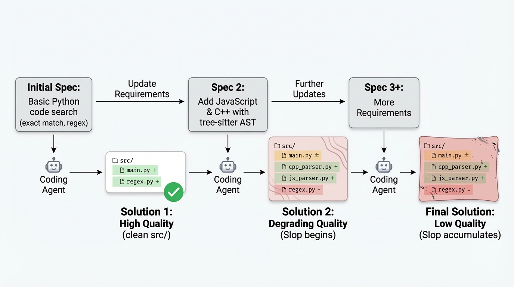
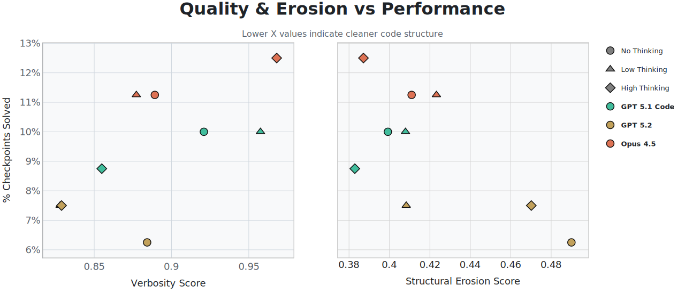
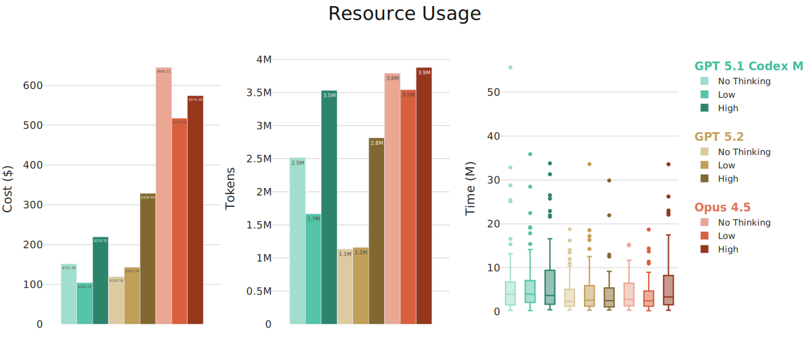
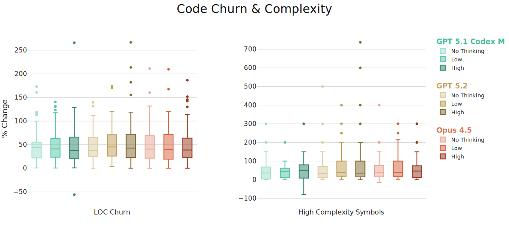

When building real software, it is impossible to know the whole problem space or specification up front. Requirements evolve as the problem is better understood, and code must be updated repeatedly to reflect those changes. Early design decisions often determine the difficulty of these updates.

Despite this, most agentic software engineering benchmarks evaluate models as if specifications were a perfect oracle: a single, fixed problem that can be solved in one pass, after which no further changes are required. This framing misses the fundamental iterative nature of software development.

We introduce **SlopCodeBench (SCBench)**, a benchmark that evaluates coding agents under *iterative* specification updates. Each problem is framed as a sequence of checkpoints: an agent implements an initial specification, then extends its own solution to satisfy new requirements, and then extends it again. In this setting, early design choices may either support later extensions or make them increasingly difficult.

This initial release comprises *18 novel problems, each with 3–6 checkpoints*. Problems begin with a core specification and are incrementally extended with additional functionality. For example, an agent may first implement a text search tool for Python files, then extend it to support JavaScript and C++, and finally add support for tree-sitter fields. Agents are evaluated in a black-box setting: only a CLI interface or API contract is provided, with no prescribed function signatures, module boundaries, or architectural guidance.

Rather than attempting to assign a single notion of “code quality,” we examine two surface properties of agent-generated code under iteration: **verbosity**, characterized by overly defensive code and redundant anti-patterns, and **structural erosion**, characterized by organizational strain such as control-flow complexity and brittle structure. We use “**slop**” informally to refer to surface-level verbosity and structural patterns, without implying a judgment of overall code quality. This approach has produced some exciting preliminary findings: In our experiments, progress through iterative specifications is often associated with increased verbosity, while advancement is constrained when structural erosion accumulates. These dimensions move in different, sometimes opposing, directions, *revealing trade-offs that are invisible in single-shot evaluations*.

Inspired by [Terminal Bench](https://www.tbench.ai), we release SCBench as a community-driven benchmark. We provide guidelines for contributing new problems and define acceptance criteria to ensure consistency across tasks. This release is intended as a v0.1 exploratory probe rather than a definitive evaluation, to enable further investigation into long-horizon agentic coding behavior.

# What We Measure

Beyond correctness, we focus on other measurable issues in the code. We distinguish between two types of code quality issues that erode the maintainability of software:

**Verbosity** is the surface-level erosion of quality through overly verbose code. Such artifacts increase the cognitive load required to understand what a snippet is doing. We look at specifically: 

* LLM as a judge – we have crafted 45 generic criteria for identifying overly verbose issues in code. Some examples are “narration comments”, “unrequested features”, and “handrolled standard operations."  
* AST-Grep rules – We handcrafted additional AST-Grep rules following the patterns that we consider to erode at code quality. These are checked to ensure there is no overlap with the lint or rubric rules.

**Structural Erosion** is the deeper architectural problem with a solution indicative of haphazardly solving the problem in minimal work required. They range from poor separation of concerns to abstractions that violate the single-responsibility principle. Without the iterative design of CEB, these would be too subjective to measure. Instead, we look at:

* Cost, time, and token usage to progress from checkpoint N to N+1  
* The number of lines added and removed to go from N to N+1.  
* What is the percent change in the number of decision points in a piece of code. Cyclomatic complexity is the number of [if/elif/while/for/except/etc in a block.](https://radon.readthedocs.io/en/latest/intro.html#cyclomatic-complexity)    
* Curated Ruff Linting Errors –  While linting errors by themselves are not indicative of careless design, and some are pretty useless, there are a large number of linting errors in Ruff that signal the exact qualities of structural erosion that we care about. For example, [SIM](https://docs.astral.sh/ruff/rules/#flake8-simplify-sim) or [PLR](https://docs.astral.sh/ruff/rules/#refactor-plr).

**Example from GPT-5.2 on checkpoint 4 of `code_search`:**  
```python
if selector == "literal":
    return (
        _selector_matches(language=language, selector="string_literal", node=node)
        or _selector_matches(language=language, selector="numeric_literal", node=node)
        or _selector_matches(language=language, selector="boolean_literal", node=node)
        or _selector_matches(language=language, selector="null_literal", node=node)
        or _selector_matches(language=language, selector="array_literal", node=node)
        or _selector_matches(language=language, selector="object_literal", node=node)
    )
```
This approach has all of the hallmarks of both overly *verbose code* and *structural erosion* that we care about. From the six chained or conditions to the repeating of `==` comparisons that could easily be a dictionary lookup. Such patterns take time to understand and could easily be abstracted away. It could work in the present (hint it does not), it creates more buildup that will need to be handled eventually when 

Now let's look at the *same* functionality from the same model in a different run:  
```python
if selector == "string_literal":
        return t in ("string", "string_literal", "raw_string_literal", "template_string")
    if selector == "numeric_literal":
        return t in ("number", "number_literal", "integer", "float")
    if selector == "boolean_literal":
        return t in ("true", "false")
    if selector == "null_literal":
        return t in ("null", "none", "nullptr")
    if selector == "array_literal":
        return t in ("array", "list")
    if selector == "object_literal":
        return t in ("object", "dictionary")
    if selector == "literal":
        return _node_matches_selector(language, "string_literal", node, text_bytes) or _node_matches_selector(
            language, "numeric_literal", node, text_bytes
        ) or _node_matches_selector(language, "boolean_literal", node, text_bytes) or _node_matches_selector(
            language, "null_literal", node, text_bytes
        ) or _node_matches_selector(language, "array_literal", node, text_bytes) or _node_matches_selector(
            language, "object_literal", node, text_bytes
        )
```
It has all the bad parts of the prior example, but somehow makes it even worse. While these are single examples, they get at the core of why it is *so* crucial that, as a community, we have a benchmark to measure these behaviors. **They affect every aspect of how agents and humans interact with code written by an LLM.**

# Iterative Evaluation Is The Future

[Aider](https://aider.chat/docs/leaderboards/) and [SWE-Bench](https://www.swebench.com) evaluate an agent’s ability to solve an issue given a frozen repository. Undoubtedly, this is an important capability, but this approach addresses only a single point in time. An agent could produce an entirely viable fix that is a distance from the ground truth. Seeing that fix instead of the ground truth would fundamentally change how developers iterate on the codebase going forward. Thus, measuring qualitative metrics at a single snapshot in time yields a noisy signal that is scaffolded by prior human decisions.  Furthermore, agents are not evaluated on their performance in long-horizon coding tasks, where they must either live with or redesign their original choices. **Viewing agentic benchmarks as iterative processes is the only way to evaluate the true nature of software engineering.**

We must adopt this framing both now and for the future of agentic coding. Much of the recent discourse on agentic coding tools has focused on the “slop” they generate (i.e., [verbose comments](https://x.com/ericzakariasson/status/1995671800643297542), [defensive coding](https://x.com/vikhyatk/status/1988398161665356121), [bloat](https://x.com/giffmana/status/1964038932179390759)). While “slop” is ill-defined, the core of these grievances hits squarely on the limitations of single-iteration benchmarks. It is tough to understand and maintain code riddled with these issues. This extends to structural issues generated by models: making minor modifications often requires rewriting the entire codebase because it is easier than extending agent-written code. Iterative benchmarks like SCBench are crucial for truly autonomous SWE agents. Without them, we would have no way to measure their ability to function autonomously given only specification updates, because it is impossible for us to know *every* required feature or extension from the outset.

# Design Philosophy

None of this would be possible without deliberate design choices in our benchmark construction:

**No prescribed interfaces.** All that is provided is the external contract of either the CLI interface or the API endpoints and response formats. Agents select the underlying architecture and the approach to solving the problem. Providing a function signature or other internal hints would mask the signal we want to measure.

**No explicit test cases or test suite.** The model only sees the examples in the spec and the explanation of the behaviors. Part of eroding code quality is the inability to think of obvious edge cases for a spec. Thus, we require the agent to identify and handle the specified edge cases.

**Black-box and language agnostic evaluation.** Solutions are judged purely on the outputs they produce, given an input. Each problem includes normalization code to ensure that minor arbitrary decisions, such as white-space formatting, do not affect the solution’s correctness.


# Results

We detail our initial results here. As we continue to add more problems and collect more run data, we hope to develop these metrics further to understand better how agents interact with the iterative nature of software development. 

## Metrics

As every problem, and by implication every checkpoint, requires a different amount of code to solve it we normalize our quality by **logical lines of code**. The intuition is that we want to quantify *how often* a user encounters artifacts of overly verbose code or erosion of the code's overall structure. We do not include comments or blank lines in this code count.

Our two main quality metrics are:

* **Verbosity** is the count of the number of occurrences of either the AST Grep rules or the LLM as a Judge flagged spans equally compared to the logical lines of code. It is calculated as the sum:

```  
Verbosity = (AST-Grep Violations + Rubric Violations) / LOC + (trivial wrappers + single use functions) / Total Functions  
```

* A **trivial wrapper** in this case is a function that returns the result of another function as its only node  
* A **single** **use function** is one that is only ever called once.  
* **Structural Erosion Score** is the percentage of functions with \> 10 Cyclomatic Complexity, summed with the number of lint errors per line of code. Symbols with cyclomatic complexity greater than 30 are counted twice. We follow radon in establishing these cutoff points.

We average these across all checkpoints. 

## Models

We report runs for the Models:

* **GPT 5.1 Codex Max** and **GPT 5.2** ran through the codex CLI in headless mode  
* **Opus 4.5** using the Claude Code CLI 

For all setups, we use a simple prompt that only tells the agent to “Implement a program that 100% solves the specification. That is all you need to do.” We also instruct it to track all the libraries it uses in a requirements file. This prompt eliminates the possibility of biasing the agent toward a specific approach, instead giving it the freedom to decide. 

# Initial Results

  

**Takeaway:** Our initial results indicate a stronger relationship between code verbosity and agent performance. Given that more verbose code could be easier for the model to understand in subsequent checkpoints.  




**Takeaway:** Clearly, Opus 4.5 is the highest performer in this setting, yet it is interesting to note that for both the Codex Max and Opus, the usage of the non-thinking setting is well above the low-thinking setup. This implies that the non-thinking models take a more brute-force approach at each checkpoint than is required as the process progresses.

## Deltas Between Checkpoints
We define **delta** as the percentage change from checkpoint N to N+1. We plot them here for LOC and High Complexity symbols:

****
  
**Takeaway:** There is significant growth, checkpoint over checkpoint, in symbols with high complexity (Cyclomatic complexity > 10), indicating a weak overall structure. For *newly* flagged spans, during LLM evaluation as a judge, we observe a significant increase relative to the prior checkpoint. 

## Agent Design Decisions

While it is not currently possible to run each of those runs multiple times due to the cost, we instead run the agents in different settings numerous times on a subset of problems:

* We have 21 total runs across five setups on three selected problems:  
  * **`code_search`**: almost every agent gets the first two checkpoints right due to their simplicity, but the third checkpoint requires them to match structural patterns in code through AST parsing. After this point, none pass another checkpoint  
  * **`file_backup`**: Agents fail to respect the ordering in the examples given and end up unable to pass any checkpoint outside.  
  * **`trajectory_api:`** Implementing a rest API with state management

Here are their mean test pass rates across the runs:

| setup | N | `code_search` | `file_backup` | `trajectory_api` |
| :---- | :---- | :---- | :---- | :---- |
| gpt-5.1-codex-max/high | 6 | 0.688 ± 0.142 | 0.352 ± 0.209 | 0.505 ± 0.056 |
| gpt-5.1-codex-max/low | 3 | 0.560 ± 0.213 | 0.077 ± 0.025 | 0.503 ± 0.061 |
| gpt-5.2/high | 7 | 0.816 ± 0.007 | 0.504 ± 0.031 | 0.533 ± 0.024 |
| gpt-5.2/low | 5 | 0.796 ± 0.018 | 0.390 ± 0.106 | 0.533 ± 0.043 |

The interesting parts begin when we examine the average coefficient of variance for each checkpoint within their setup group:

| where | Test Pass Rate | Non-Regression Pass Rate | Delta LOC | Churn Ratio | Mean Function Line Count |
| :---- | ----: | ----: | ----: | ----: | ----: |
| First | 0.121 | 0.121 | — | — | 0.162 |
| Middle | 0.251 | 0.299 | 0.247 | 0.24 | 0.165 |
| Final | 0.313 | 0.388 | 0.433 | 0.548 | 0.176 |

Quick notation:

* **When** represents which checkpoint this is from.  
  * *First* is the first checkpoint.  
  * *Middle* is any checkpoint that falls between the first and last  
  * *Final* is well…the last checkpoint  
* **Test Pass Rate** is the % of tests passed  
* **Non-Regression Pass Rate** is the non-regression test for *that* checkpoint  
* **Delta LOC** is the percent change in logical lines of code from the previous checkpoint  
* **Churn Ratio** is the number of lines added or removed divided by the number of lines in the last checkpoint. This only includes source files in the target language.  
* **Mean Function Line Count** is the average number of lines per function.

While the pass rates may seem random or even noisy, they are not. Instead, it is what each model decides at the initial checkpoint, which is why the pass rates are consistent. But those decisions compound across checkpoints, leading to very different results. This is a *significant* issue regarding their reliability. **Two developers producing entirely different outcomes on the same project is objectively negative.** 

# Acknowledgements

This would not be possible without the amazing group of people who have worked on this project: [Devjeet Roy](https://devjeetr.github.io), [Alex Yun](https://www.linkedin.com/in/alexander-yun-19ab74181), [Changho Shin](https://ch-shin.github.io), [Alex Gu](https://minimario.github.io), [Albert Ge](https://www.albertge.com), [Dyah Adila](https://dyahadila.github.io), [Aws Albarghouthi](https://pages.cs.wisc.edu/~aws), [Fred Sala](https://pages.cs.wisc.edu/~fredsala)

We also want to thank Abtin Molavi, Amanda Xu, June Cho, Xavier Garcia, Samuel Guo, and Nick Roberts for the feedback on this project as it developed. Additionally, we want to acknowledge the support from DARPA and the NSF on this project. Finally, we thank the fantastic team developing Terminal Bench for their inspiration and feedback on this.
